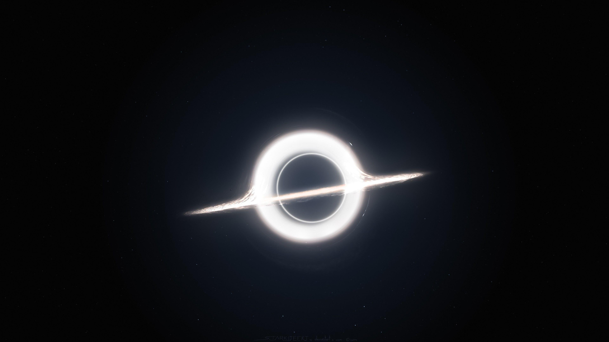

# 🛰️ Spacecraft Detection & Debris Classification



A full-stack application using YOLOv8 for detecting spacecraft and classifying space debris in images.

## 🌟 Features

- **AI-Powered Detection**: YOLOv8 model trained for space object recognition
- **Web Interface**: React-based frontend with drag-and-drop upload
- **REST API**: Flask backend for processing images
- **Real-time Results**: Immediate visualization of detection results

## 🚀 Deployment Architecture

```mermaid
graph LR
    A[User] --> B[Frontend: React/Vite]
    B --> C[Backend: Flask/Python]
    C --> D[YOLOv8 Model]